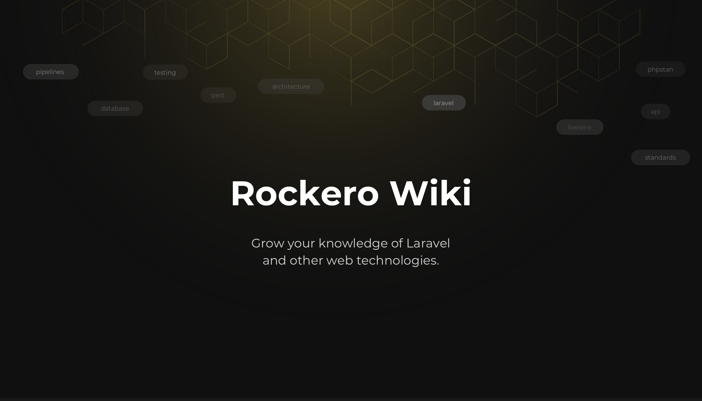

<picture>
      
</picture>

# Laraverse Wiki

Since we are taking the Laravel community in the `Czech Republic` and `Slovakia` to the next level, we decided to share this **Wiki** not only about Laravel.

Most of the sections were our internal best-practices and tips. However, we decided to share them with others to help the local community grow.

Our goal is to increase the awareness of Laravel and its potential in our countries and perhaps over time to teach developers how to use it to get the most out of it.

**This is just the beginning!**

---

## Contribution Guide

Would you also like to share your **knowledge**? You can fork this repository and submit a pull request.

You only need to include English, we will add translations manually within the pull request.

### How to write?

In order to maintain consistency, please comply with the following points:

- Page names should be in `kebab-case`.
- Each new page should have a table of contents.
- Split sections by headings and **use only levels `1`, `2`, and `3`**.
- Always add code examples wherever possible.
- When adding a new class type, you should add the correct naming and create a command, when available.
- Important messages should be written in `quotes` and may be marked by type - `Pro tip`, `Warning` and more.
